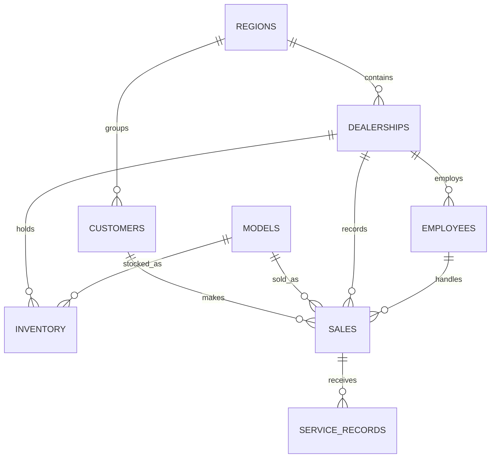

<p align="center">
  
</p>

<h1 align="center">Toyota Car Sales Analytics</h1>

<p align="center">
  <strong>An end-to-end SQL and Python data analytics portfolio project</strong>
</p>

<p align="center">
  
  
  
  
</p>

> **Disclaimer:** This project uses synthetic educational data and is not affiliated with Toyota Motor Corporation. The Toyota mark is included only for portfolio identification. The vehicle hero below is an AI-generated project visual, not an official product photograph.


## Project overview

This project combines **MySQL** and **Python** to analyse a normalised Toyota car-sales database containing **60,000+ synthetic records** across sales, customers, models, dealerships, regions, employees, inventory, and after-sales service.

The SQL component builds and queries the relational database using joins, CTEs, subqueries, window functions, ranking, growth calculations, and business-rule validation. The Python component connects securely to MySQL, loads all eight tables into pandas, validates and cleans the data, creates supported features, performs exploratory analysis, builds interactive visualisations, calculates KPIs, and generates evidence-based business insights.

## Business objective

- Evaluate overall sales and net-revenue performance.
- Identify the best-selling and highest-revenue models.
- Analyse monthly, yearly, regional, city, fuel-type, and payment trends.
- Measure dealership, employee, customer, inventory, and service performance.
- Detect data-quality problems without deleting valid observations automatically.
- Convert analytical results into practical business recommendations.

## Executive KPI dashboard


| KPI | Result |
|---|---:|
| Sales transactions | 40,000 |
| Units sold | 80,130 |
| Net revenue | $3.18 billion |
| Average discount | 6.24% |
| Analysis period | 2021–2025 |
| Best-selling model | Tundra |
| Tundra units sold | 6,973 |
| Highest-revenue model | Tundra |
| Tundra net revenue | $385.44 million |
| Highest-revenue region | Africa |
| Africa net revenue | $542.29 million |

Net revenue is calculated using the rule documented in the SQL project:

```text
net revenue = quantity × unit_price_usd × (1 − discount_pct / 100)
```

All monetary analysis remains in **USD**, matching the source schema. No exchange rate is invented.

## Database design

The project uses eight related tables:

| Table | Purpose | Rows |
|---|---|---:|
| `regions` | Geographic sales regions | 6 |
| `models` | Toyota model catalogue and base prices | 12 |
| `dealerships` | Dealership locations linked to regions | 120 |
| `employees` | Sales employees linked to dealerships | 600 |
| `customers` | Individual, corporate, and government customers | 8,000 |
| `sales` | Vehicle sales transactions | 40,000 |
| `inventory` | Model stock held by dealerships | 4,262 |
| `service_records` | After-sales service activity | 7,000 |

### Main relationships



## Tools and technologies

### SQL

- MySQL 8
- MySQL Workbench
- Normalised relational design
- Primary and foreign keys
- Multi-table joins
- Common table expressions and recursive CTEs
- Correlated and non-correlated subqueries
- Window functions: `RANK`, `DENSE_RANK`, `ROW_NUMBER`, `NTILE`, `PERCENT_RANK`, and `LAG`
- Running totals, rolling averages, and period-over-period growth
- Conditional aggregation, `CASE`, `NOT EXISTS`, and relational division

### Python

- Jupyter Notebook
- pandas and NumPy
- SQLAlchemy and PyMySQL
- Matplotlib and Seaborn
- Plotly Express and Plotly Graph Objects
- Secure password input and environment variables
- Reusable validation and missing-value functions
- Static and interactive business visualisations

## Python analysis workflow

The notebook is divided into clear portfolio-ready phases:

1. **Import required libraries** and configure a Toyota-themed visual style.
2. **Connect securely to MySQL** without exposing the password.
3. **Load and inspect all eight tables** with shapes, types, samples, summaries, missing values, duplicates, cardinality, and memory usage.
4. **Clean and validate the data** using working copies, safe date conversion, text normalisation, key checks, relational validation, and diagnostic outlier analysis.
5. **Create supported features**, including gross revenue, discount amount, net revenue, sale month, sale year, sale quarter, and revenue contribution.
6. **Perform EDA** across models, time, fuel type, price, discounts, correlations, regions, cities, and product concentration.
7. **Build a KPI dashboard** and ranked performance tables.
8. **Generate numerical insights and recommendations** directly from calculated outputs.

## SQL analysis coverage

The SQL analysis contains **39 documented business queries**, including:

- Full transaction view using six-table joins
- Model revenue and contribution percentage
- Top three models in every region
- Dealership ranking within each region
- Year-over-year and month-over-month growth
- Three-month rolling revenue and running totals
- Employee and dealership performance
- High-value customers and RFM analysis
- Repeat versus one-time customers
- Discount-band and payment-method performance
- Inventory availability, value, and estimated sell-through
- Service satisfaction and time to first service
- Quarterly revenue pivot and best month by year
- Data-quality anomaly detection
- Executive annual KPI summary

## Key findings

- The database contains **40,000 sales transactions** representing **80,130 units sold**.
- Total net revenue is approximately **$3.18 billion** over 2021–2025.
- **Tundra is the best-selling model**, with **6,973 units sold**.
- **Tundra is also the highest-revenue model**, generating approximately **$385.44 million** and contributing about **12.12%** of total revenue.
- **Africa** is the highest-revenue region, generating approximately **$542.29 million**.
- The average transaction discount is **6.24%**.
- Regional model rankings reveal meaningful differences in product preference.
- Customer analysis identifies high-value, repeat, inactive, and multi-model customers.
- Inventory and service tables extend the project beyond sales into stock availability and after-sales experience.

## Scope limitations

The project does not invent unavailable fields. The schema contains no transmission, transaction-level cost of goods sold, profit, marketing campaign, customer age or gender, vehicle manufacture year, or competitor information. Therefore:

- Transmission preference is not calculated.
- Inventory cost is not treated as sales profit or COGS.
- Profit and profit margin are not calculated.
- Customer demographic segmentation is not performed.
- Marketing attribution and competitor comparison are outside the current scope.

## Repository structure

```text
Toyota-car-sales-analytics/
│
├── assets/
│   ├── kpi_dashboard.png
│   ├── toyota_logo.png
│   └── toyota_tundra_hero.png
├── 01_create_schema.sql
├── 02_load_data.sql
├── Toyota_car_sales_analytics.sql
├── Toyota_Car_Sales_Analysis.ipynb
└── README.md
```

| File | Description |
|---|---|
| `01_create_schema.sql` | Creates the database, eight tables, keys, and relationships |
| `02_load_data.sql` | Loads the synthetic project dataset |
| `Toyota_car_sales_analytics.sql` | Contains 39 documented SQL business analyses |
| `Toyota_Car_Sales_Analysis.ipynb` | Complete Python inspection, cleaning, EDA, KPI, and insight workflow |
| `assets/` | Local images used by this README |

## How to run the project

### 1. Create the MySQL database

Open MySQL Workbench and run:

```text
01_create_schema.sql
```

### 2. Load the data

Run:

```text
02_load_data.sql
```

### 3. Validate the database

```sql
USE toyota_car_sales_analysis;

SHOW TABLES;

SELECT COUNT(*) AS sales_rows
FROM sales;
```

The final query should return `40000`.

### 4. Run the SQL analysis

Open `Toyota_car_sales_analytics.sql` and execute the documented queries individually or section by section.

### 5. Install the Python dependencies

```bash
pip install pandas numpy matplotlib seaborn plotly sqlalchemy pymysql jupyterlab
```

### 6. Configure database credentials securely

The notebook supports environment variables:

```text
TOYOTA_DB_USER
TOYOTA_DB_HOST
TOYOTA_DB_PORT
TOYOTA_DB_NAME
TOYOTA_DB_PASSWORD
```

If `TOYOTA_DB_PASSWORD` is not set, the notebook requests it through a hidden password prompt. Never commit a password or `.env` file to GitHub.

### 7. Run the notebook

```bash
jupyter lab Toyota_Car_Sales_Analysis.ipynb
```

Run all cells from top to bottom after confirming that MySQL is running and the database is loaded.

## Future improvements

- Add transaction-level COGS to calculate profit correctly.
- Add customer demographic and marketing-channel data.
- Add historical inventory snapshots for stronger stock-flow analysis.
- Add dated exchange rates for local-currency reporting.
- Build a validated sales-forecasting model.
- Publish an interactive Streamlit dashboard.
- Automate credential-safe database refreshes.

## Author

**Hitesh Sharma**  
Aspiring Data Analyst

---

If this project helped you, consider starring the repository.
