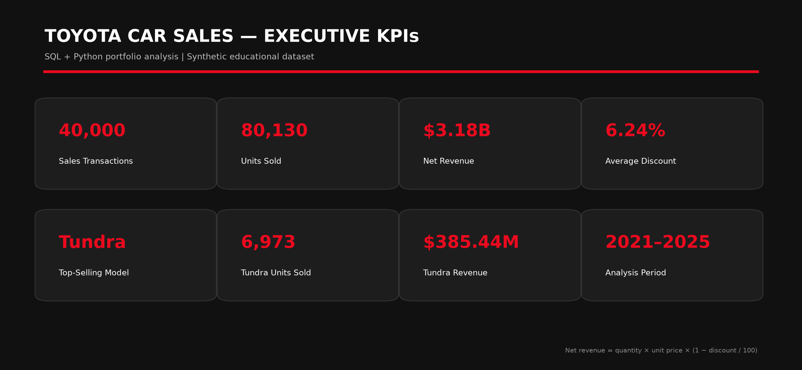

  

# Toyota Car Sales Analysis — SQL + Python

A beginner-friendly data analytics portfolio project built with **MySQL, Python, pandas, Matplotlib and Seaborn**.

The dataset is synthetic and is used only for learning and portfolio purposes. This project is not affiliated with Toyota Motor Corporation.

## Project snapshot

| Metric | Result |
|---|---:|
| Sales transactions | 40,000 |
| Units sold | 80,130 |
| Net revenue | $3.18B |
| Average discount | 6.24% |
| Period | 2021–2025 |
| Best-selling model | Tundra |
| Tundra units sold | 6,973 |
| Highest-revenue region | Africa |

Net revenue = `quantity × unit_price_usd × (1 - discount_pct / 100)`

## What I analysed

- overall sales, units sold and net revenue
- model performance
- yearly and monthly trends
- regional and city performance
- fuel type, customer type and payment method
- dealership and employee performance
- repeat customers
- inventory availability
- service satisfaction
- discount bands and price differences
- basic data-quality checks

## Tools

MySQL 8, Python 3, pandas, Matplotlib, Seaborn, SQLAlchemy, PyMySQL and Jupyter Notebook.

I kept the library list small so I can explain every part of the project clearly in an interview.

## Notebook

`Toyota_Car_Sales_Analysis.ipynb` contains SQL, Python and EDA in one notebook:

1. Import libraries
2. Connect to MySQL
3. Load the eight tables
4. Check missing values and duplicates
5. Perform basic cleaning
6. Create revenue and date features
7. Run practical SQL queries
8. Build one analysis DataFrame
9. Perform EDA
10. Create charts
11. Calculate KPIs
12. Write findings and recommendations

The notebook is intentionally compact and stores no large outputs.

## SQL file

`Toyota_car_sales_analytics.sql` contains **18 practical queries** using SELECT, GROUP BY, ORDER BY, aggregate functions, JOIN, CASE, date functions, HAVING, LIMIT and basic data-quality checks.

I removed unnecessary advanced SQL so the project stays suitable for a fresher portfolio.

## Dataset

| Table | Rows |
|---|---:|
| regions | 6 |
| models | 12 |
| dealerships | 120 |
| employees | 600 |
| customers | 8,000 |
| sales | 40,000 |
| inventory | 4,262 |
| service_records | 7,000 |

The existing `01_create_schema.sql` and `02_load_data.sql` files are still used to create and load the database.

## Key findings

- **40,000** transactions represent **80,130** units sold.
- Total net revenue is about **$3.18 billion**.
- **Tundra** is the highest-revenue model at about **$385.44 million** and also has the highest units sold at **6,973**.
- **Africa** records the highest regional revenue at about **$542.29 million**.
- Revenue is relatively stable from 2021 to 2025, with **2024** being the highest year.
- Hybrid vehicles generate more revenue than gasoline or electric vehicles in this synthetic dataset.
- Cash, loan and lease revenue are fairly balanced.

## How to run

1. Run `01_create_schema.sql`.
2. Run `02_load_data.sql`.
3. Run `pip install -r requirements.txt`.
4. Open `Toyota_Car_Sales_Analysis.ipynb`.
5. Enter your MySQL username and password when prompted.

## Interview explanation

**business question → SQL query → Python cleaning → EDA chart → finding → business meaning**

That keeps the project practical and easy to defend in a fresher data analyst interview.
